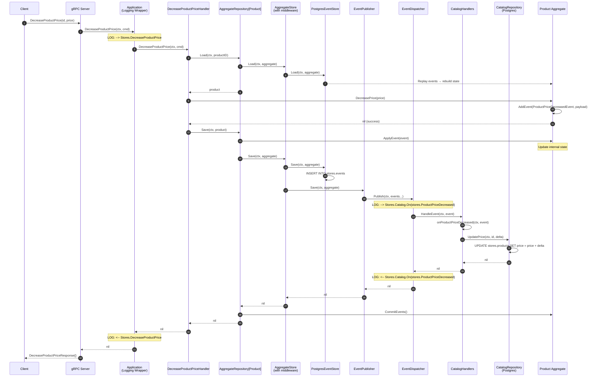

# Product Price Change Flow

This document describes the flow when increasing or decreasing a product's price in the stores module.

## Overview

The price change operation follows the **Event Sourcing** pattern with **CQRS** (Command Query Responsibility Segregation):

1. **Command Side**: Updates the Product aggregate and persists events
2. **Event Handlers**: React to domain events and update read models
3. **Query Side**: Reads from denormalized read models (catalog)

## Sequence Diagram



## Methods Involved

### gRPC Layer
| Component | Method | File |
|-----------|--------|------|
| `server` | `DecreaseProductPrice(ctx, request)` | `stores/internal/grpc/server.go` |
| `server` | `IncreaseProductPrice(ctx, request)` | `stores/internal/grpc/server.go` |

### Application Layer
| Component | Method | File |
|-----------|--------|------|
| `Application` (logging) | `DecreaseProductPrice(ctx, cmd)` | `stores/internal/logging/application.go` |
| `DecreaseProductPriceHandler` | `DecreaseProductPrice(ctx, cmd)` | `stores/internal/application/commands/decrease_product_price.go` |
| `IncreaseProductPriceHandler` | `IncreaseProductPrice(ctx, cmd)` | `stores/internal/application/commands/increase_product_price.go` |

### Domain Layer
| Component | Method | File |
|-----------|--------|------|
| `Product` | `DecreasePrice(price)` | `stores/internal/domain/product.go` |
| `Product` | `IncreasePrice(price)` | `stores/internal/domain/product.go` |
| `Product` | `AddEvent(name, payload)` | `internal/es/aggregate.go` |
| `Product` | `ApplyEvent(event)` | `stores/internal/domain/product.go` |

### Infrastructure Layer
| Component | Method | File |
|-----------|--------|------|
| `AggregateRepository[Product]` | `Load(ctx, id)` | `internal/es/aggregate_repository.go` |
| `AggregateRepository[Product]` | `Save(ctx, aggregate)` | `internal/es/aggregate_repository.go` |
| `EventStore` | `Load(ctx, aggregate)` | `internal/postgres/event_store.go` |
| `EventStore` | `Save(ctx, aggregate)` | `internal/postgres/event_store.go` |
| `EventPublisher` | `Save(ctx, aggregate)` | `internal/es/event_publisher.go` |
| `EventDispatcher` | `Publish(ctx, events...)` | `internal/ddd/event_dispatcher.go` |

### Event Handlers
| Component | Method | File |
|-----------|--------|------|
| `CatalogHandlers` | `HandleEvent(ctx, event)` | `stores/internal/application/catalog_handlers.go` |
| `CatalogHandlers` | `onProductPriceDecreased(ctx, event)` | `stores/internal/application/catalog_handlers.go` |
| `CatalogHandlers` | `onProductPriceIncreased(ctx, event)` | `stores/internal/application/catalog_handlers.go` |

### Read Model (Query Side)
| Component | Method | File |
|-----------|--------|------|
| `CatalogRepository` | `UpdatePrice(ctx, id, delta)` | `stores/internal/postgres/catalog_repository.go` |

## Event Flow

### 1. Command Reception
The gRPC server receives a `DecreaseProductPrice` or `IncreaseProductPrice` request.

### 2. Aggregate Loading
The handler uses `AggregateRepository.Load()` which:
- Creates a new Product aggregate instance
- Queries `stores.events` table for all events for this aggregate
- Replays events to rebuild the current state

### 3. Domain Logic Execution
The `Product.DecreasePrice()` or `Product.IncreasePrice()` method:
- Validates the price change
- Creates a `ProductPriceChanged` event with the delta
- Adds the event to the aggregate's pending events

### 4. Aggregate Saving
The `AggregateRepository.Save()` method:
- Applies pending events to update aggregate state
- Delegates to `AggregateStore.Save()` (with middleware chain)

### 5. Event Store Persistence
The `EventStore.Save()` middleware:
- Persists events to `stores.events` table

### 6. Event Publishing
The `EventPublisher.Save()` middleware:
- Publishes events to the `EventDispatcher`
- Dispatcher notifies all registered handlers

### 7. Read Model Update
The `CatalogHandlers.HandleEvent()`:
- Receives `ProductPriceDecreasedEvent` or `ProductPriceIncreasedEvent`
- Calls `CatalogRepository.UpdatePrice()` to update the read model
- Updates `stores.products` table with the new price

## Database Tables

### Event Store (Write Model)
```sql
-- stores.events
INSERT INTO stores.events
  (stream_id, stream_name, stream_version, event_id, event_name, event_data, occurred_at)
VALUES
  ($1, $2, $3, $4, 'stores.ProductPriceDecreased', $5, $6)
```

### Catalog (Read Model)
```sql
-- stores.products
UPDATE stores.products
SET price = price + $1, updated_at = NOW()
WHERE id = $2
```

## Log Output Example

```
06:39:43.767PM INF --> Stores.DecreaseProductPrice
06:39:43.774PM INF --> Stores.Catalog.On(stores.ProductPriceDecreased)
06:39:43.775PM INF <-- Stores.Catalog.On(stores.ProductPriceDecreased)
06:39:43.775PM INF <-- Stores.DecreaseProductPrice
```

## Testing with grpcurl

### Decrease Product Price
```bash
grpcurl -plaintext -d '{
  "id": "<product_id>",
  "price": 0.50
}' localhost:8086 storespb.StoresService/DecreaseProductPrice
```

### Increase Product Price
```bash
grpcurl -plaintext -d '{
  "id": "<product_id>",
  "price": 1.00
}' localhost:8086 storespb.StoresService/IncreaseProductPrice
```

### Verify Price Change
```bash
grpcurl -plaintext -d '{
  "id": "<product_id>"
}' localhost:8086 storespb.StoresService/GetProduct
```

