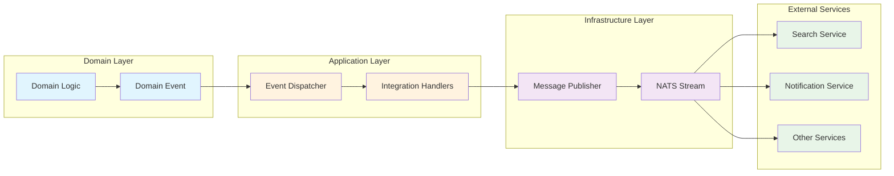
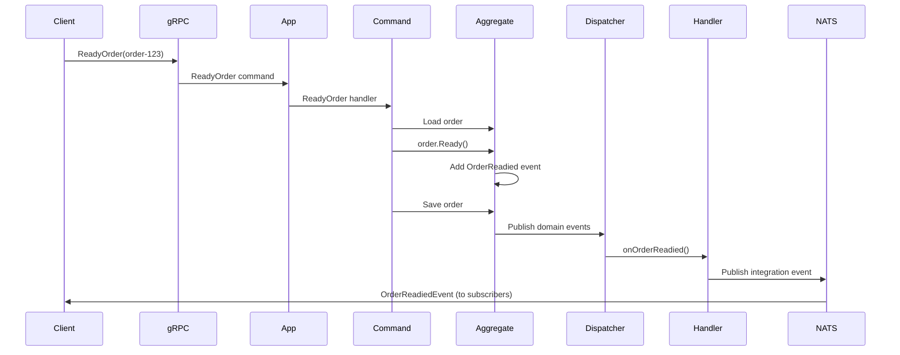

# Integration Event Flow

**Integration Event Handlers** convert internal domain events into external integration events that other services can consume.

## Event Flow Pattern



**Flow Summary:**
1. **Domain Logic** generates internal **Domain Events**
2. **Event Dispatcher** routes events to **Integration Handlers** within the same service
3. **Integration Handlers** transform domain events to external **Integration Events**
4. **Message Publisher** sends events to **NATS Stream**
5. **External Services** consume integration events for cross-service communication

## Key Components

- **Domain Events**: Internal business logic events (e.g., `OrderCreated`)
- **Event Dispatcher**: Routes domain events to subscribers within the service
- **Integration Handlers**: Transform domain events to protobuf integration events
- **Message Publisher**: Publishes integration events to NATS streams
- **Integration Events**: External API events (e.g., `OrderCreatedEvent`) consumed by other services

## Example: Order Service Integration

```go
// 1. Domain event generated in aggregate
order.CreateOrder(...) // → domain.OrderCreated domain event

// 2. Event dispatcher routes to integration handlers
domainDispatcher := ddd.NewEventDispatcher[ddd.AggregateEvent]()
handlers.RegisterIntegrationEventHandlers(integrationEventHandlers, domainDispatcher)

// 3. Integration handler transforms and publishes (same service)
func (h *IntegrationEventHandlers) onOrderCreated(ctx, event) error {
    // Convert domain.OrderCreated → orderingpb.OrderCreated
    return h.publisher.Publish(ctx, orderingpb.OrderAggregateChannel,
        ddd.NewEvent(orderingpb.OrderCreatedEvent, &orderingpb.OrderCreated{...}))
}

// 4. Other services consume integration events
eventStream.Subscribe(orderingpb.OrderAggregateChannel, handler,
    orderingpb.OrderCreatedEvent)
```

## Benefits

- **Clean Architecture**: Internal domain events stay internal
- **Loose Coupling**: Services react to business events, not implementation details
- **Event-Driven Flow**: Maintains asynchronous, reactive architecture
- **API Stability**: Integration events use stable protobuf contracts

## Implementation Details

### Event Handler Registration

```go
handlers.RegisterIntegrationEventHandlers(integrationEventHandlers, domainDispatcher)
```

This registers the integration event handlers as subscribers to domain events within the service's event dispatcher.

### Domain to Integration Event Mapping

| Domain Event | Integration Event | Purpose |
|-------------|------------------|---------|
| `OrderCreated` | `OrderCreatedEvent` | New order notification |
| `OrderReadied` | `OrderReadiedEvent` | Order ready for pickup |
| `OrderCanceled` | `OrderCanceledEvent` | Order cancellation |
| `OrderCompleted` | `OrderCompletedEvent` | Order fulfillment |

### Publisher Setup

Integration handlers receive a message publisher (typically NATS JetStream) that publishes events to named channels that other services can subscribe to.

## Usage Patterns

### Publishing Integration Events

1. Domain logic generates domain events
2. Event dispatcher routes to integration handlers
3. Integration handlers transform events
4. Events published to external channels

### Consuming Integration Events

Other services subscribe to integration event channels to react to business activities:

```go
eventStream.Subscribe(orderingpb.OrderAggregateChannel, orderHandler,
    orderingpb.OrderCreatedEvent, orderingpb.OrderCompletedEvent)
```

This pattern enables the **search service** and other components to index orders, send notifications, and trigger downstream business processes without tight coupling to individual service implementations.

## Complete Trigger Example: OrderReadied Event

### Event Trigger Sequence

Here's the complete flow that triggers `onOrderReadied` execution:



### Step-by-Step Execution

**1. External Trigger:**
```go
// Client calls gRPC service
orderingService.ReadyOrder(ctx, &ReadyOrderRequest{Id: "order-123"})
```

**2. gRPC Handler:**
```go
func (s server) ReadyOrder(ctx, request *ReadyOrderRequest) (*ReadyOrderResponse, error) {
    return s.app.ReadyOrder(ctx, commands.ReadyOrder{ID: request.GetId()})
}
```

**3. Application Layer:**
```go
func (a Application) ReadyOrder(ctx, cmd commands.ReadyOrder) error {
    return a.ReadyOrderHandler.ReadyOrder(ctx, cmd)
}
```

**4. Command Handler:**
```go
func (h ReadyOrderHandler) ReadyOrder(ctx, cmd ReadyOrder) error {
    order, err := h.orders.Load(ctx, cmd.ID)
    if err = order.Ready(); err != nil {  // ⚡ DOMAIN EVENT CREATED
        return err
    }
    return h.orders.Save(ctx, order)  // ⚡ EVENT DISPATCHED VIA MIDDLEWARE
}
```

**5. Domain Aggregate:**
```go
func (o *Order) Ready() error {
    o.AddEvent(OrderReadiedEvent, &OrderReadied{  // 🎯 DOMAIN EVENT
        CustomerID:  o.CustomerID,
        PaymentID:   o.PaymentID,
        TotalAmount: o.GetTotal(),
    })
    return nil
}
```

**6. Event Sourcing Infrastructure:**
```go
// Event store middleware automatically dispatches events
aggregateStore := es.AggregateStoreWithMiddleware(
    pg.NewEventStore("ordering.events", mono.DB(), reg),
    es.NewEventPublisher(domainDispatcher),  // 🎯 DISPATCHES HERE
)
```

**7. Integration Event Handler:**
```go
func (h IntegrationEventHandlers[T]) onOrderReadied(ctx, event) error {
    // 🎯 EXECUTES HERE when OrderReadied domain event is dispatched
    payload := event.Payload().(*domain.OrderReadied)
    return h.publisher.Publish(ctx, orderingpb.OrderAggregateChannel,
        ddd.NewEvent(orderingpb.OrderReadiedEvent, &orderingpb.OrderReadied{...}))
}
```

### Business Context

The `onOrderReadied` handler executes when:
- **Warehouse/Store** marks an order as ready for customer pickup
- **Delivery Service** needs to be notified of ready orders
- **Customer Notifications** should be sent about order availability
- **Search/Indexing** needs to update order status for customer queries
- **Analytics** systems need to track fulfillment metrics

### Trigger Conditions

- **API Endpoint**: `ReadyOrder` gRPC method call
- **Order State**: Must exist and be in appropriate status
- **Business Action**: Warehouse/store marks order as ready for pickup
- **Event Type**: `OrderReadied` domain event from order aggregate
- **Timing**: Immediate, synchronous with order status update
