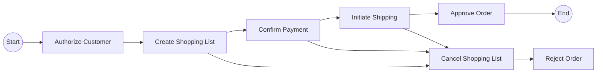

# Saga Pattern – Distributed Transaction Management

## Overview

The **Saga Pattern** is a design pattern for managing **distributed transactions** in a **microservices architecture**.

Instead of relying on a single ACID transaction across services (which is not feasible in distributed systems), a Saga breaks a transaction into a **sequence of local transactions**, each with a corresponding **compensating action**.

> **Goal:** Achieve *eventual consistency* across services without distributed locking.

---

## Why Saga Is Needed

In monolithic systems:

* A single database transaction can span multiple operations
* Rollbacks are automatic

In microservices:

* Each service owns its own database
* Distributed transactions (2PC) are slow, complex, and fragile

Saga solves this by:

* Replacing atomicity with **compensation**
* Allowing partial failures with controlled rollback

---

## Core Concepts

### 1. Local Transaction

A transaction executed by **one service**, using its own database.

Examples:

* Authorize customer
* Create order
* Reserve inventory
* Process payment

Each local transaction:

* Commits independently
* Publishes an event on success or failure

---

### 2. Compensating Transaction

An operation that **undoes** the effects of a previous local transaction.

Examples:

* Cancel order
* Release inventory
* Refund payment

> Compensation does not need to be a perfect rollback — only *logically consistent*.

---

### 3. Saga Execution Flow

A saga consists of:

* **Forward steps** (happy path)
* **Backward steps** (rollback path)

If any step fails:

1. Saga stops moving forward
2. Compensating actions execute in **reverse order**

---

## Example: Create Order Saga

### Forward Transactions

1. Authorize customer
2. Create shopping list
3. Confirm payment
4. Initiate shipping
5. Approve order

### Compensating Transactions

* Cancel shopping list
* Reject order
* Refund payment (if applicable)

---

## Visual Representation

---

## Saga Implementation Styles

### 1. Orchestration-Based Saga

A **central coordinator** controls the saga flow.

**Characteristics:**

* Explicit workflow
* Central decision-making
* Easier to reason about
* Single point of control

**Example:**

* Order Service orchestrates payment, inventory, shipping

**Pros:**

* Clear control flow
* Easier debugging
* Stronger guarantees

**Cons:**

* Coordinator can become complex
* Tighter coupling

---

### 2. Choreography-Based Saga

No central coordinator.
Services communicate via **events**.

**Characteristics:**

* Event-driven
* Services react to events
* Fully decentralized

**Pros:**

* Loose coupling
* Highly scalable
* Natural fit for event streaming

**Cons:**

* Harder to trace
* Complex failure scenarios
* Risk of cyclic dependencies

---

## Failure Handling

### What Happens on Failure?

If a step fails:

1. Saga transitions to rollback mode
2. Compensation executes in reverse order
3. System reaches a consistent state

### Important Rules

* Compensations must be **idempotent**
* Retries must be safe
* Timeouts must be handled explicitly

---

## Consistency Model

Saga provides:

* ❌ Strong consistency
* ❌ Atomicity
* ✅ Eventual consistency

Temporary inconsistency is acceptable as long as:

* System converges
* Business invariants are preserved

---

## When to Use Saga Pattern

✅ Use Saga when:

* You have multiple services with separate databases
* Transactions span service boundaries
* Eventual consistency is acceptable

❌ Avoid Saga when:

* Strong consistency is required
* Business logic cannot tolerate temporary inconsistency
* Simple monolithic transactions are sufficient

---

## Common Pitfalls

* Missing compensating actions
* Non-idempotent rollback logic
* Infinite retry loops
* Poor observability

---

## Best Practices

* Design compensations early
* Make all operations idempotent
* Add correlation IDs for tracing
* Use durable message delivery
* Monitor saga state transitions

---

## Summary

The Saga Pattern:

* Replaces distributed transactions with local ones
* Uses compensation instead of rollback
* Enables scalable, resilient microservices

> **Think of a Saga as a long-lived transaction with a plan for failure.**

---

**End of document**
